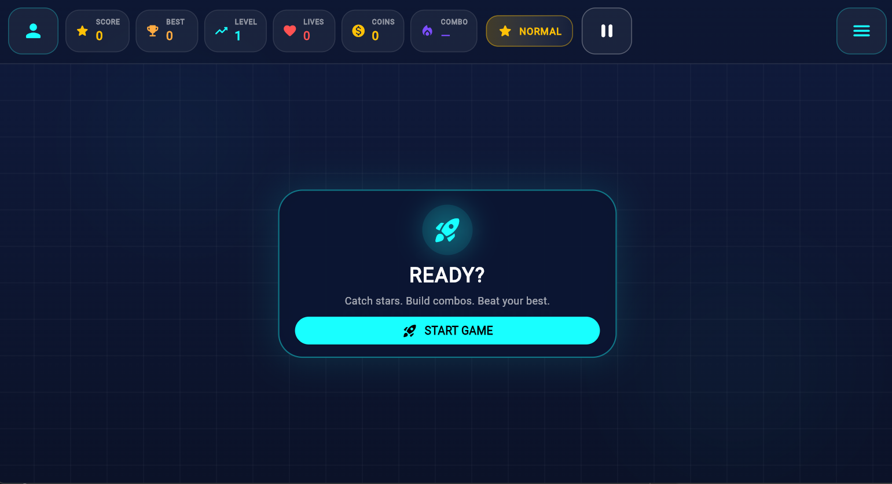
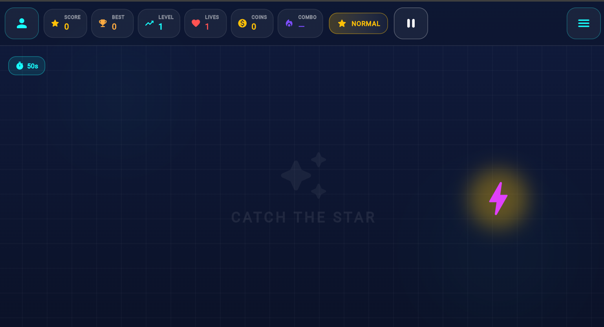
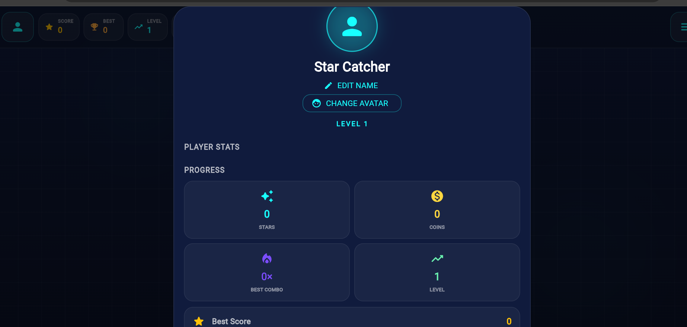
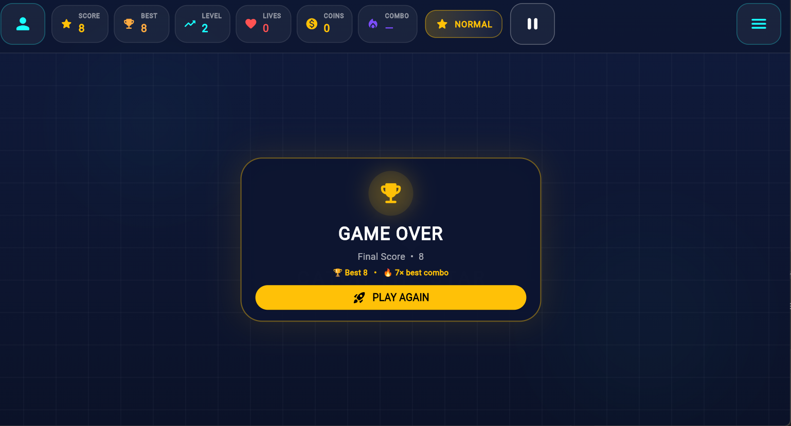

# ⭐ Star Catch

A fast-paced Flutter game where players catch falling stars, build combos, collect coins, and challenge their best score.

## 🎮 About the Game

Star Catch is a Flutter-based arcade game designed around quick reflexes and score-based gameplay.

Players can catch stars, build combos, manage lives, collect coins, and progress through different levels while using power-ups and unlocking additional game features.

The project demonstrates Flutter UI development, game logic, local data storage, audio integration, animations, and Android native functionality.

## ✨ Features

- ⭐ Star-catching gameplay
- 🏆 Score and best-score tracking
- 📈 Level progression
- ❤️ Lives system
- 🪙 Coin wallet
- 🔥 Combo system
- ⚡ Power-ups
- 🎯 Missions
- 🏅 Achievements
- 🎁 Daily rewards
- 👤 Player profile
- 📊 Player statistics
- 🎮 Multiple game modes
- 🎨 Skins
- 🌈 Themes
- 🏆 Leaderboard
- 🔊 Background music and sound effects
- ⏸️ Pause and resume gameplay
- 💾 Local game-data storage
- 📳 Haptic feedback through Android native integration

## 🖥️ Gameplay UI

The game includes a dedicated HUD displaying:

- Score
- Best score
- Current level
- Remaining lives
- Coins
- Combo
- Current game mode
- Pause control
- Player profile
- Game menu

## 🛠️ Technologies Used

- **Flutter**
- **Dart**
- **Android**
- **Material UI**
- **Java** — Android native functionality
- **SharedPreferences** — Local data storage
- **AudioPlayers** — Game audio

## 📦 Dependencies

The project uses Flutter packages including:

- `audioplayers`
- `shared_preferences`

## 📁 Project Structure

```text
star-catch/
│
├── android/
│   └── ... Android native files
│
├── assets/
│   ├── audio/
│   │   ├── catch.mp3
│   │   ├── miss.mp3
│   │   ├── game_over.mp3
│   │   └── background_music.mp3
│   │
│   └── images/
│       └── ... Game images
│
├── lib/
│   ├── audio/
│   │   └── ... Audio management
│   │
│   ├── effects/
│   │   └── ... Game effects
│   │
│   ├── features/
│   │   └── ... Game features
│   │
│   ├── game/
│   │   └── ... Game logic
│   │
│   ├── utils/
│   │   └── ... Utility classes
│   │
│   └── main.dart
│
├── screenshots/
│   ├── home.png
│   ├── gameplay.png
│   ├── profile.png
│   └── game-over.png
│
├── test/
│   └── ... Tests
│
├── pubspec.yaml
└── README.md
```

## ▶️ Getting Started

### Prerequisites

Make sure you have the following installed:

- Flutter SDK
- Dart SDK
- Android Studio or VS Code
- Android emulator or Android device

### Clone the Repository

```bash
git clone https://github.com/surya-alagesan07/star-catch.git
```

### Navigate to the Project

```bash
cd star-catch
```

### Install Dependencies

```bash
flutter pub get
```

### Run the Game

```bash
flutter run
```

## 🎯 Gameplay

The main objective is to catch falling stars and achieve the highest possible score.

Players can:

1. Catch falling stars.
2. Build combos by successfully catching stars.
3. Collect coins and power-ups.
4. Complete missions and achievements.
5. Track their personal statistics.
6. Try to beat their best score.
7. Progress through different game features and modes.

## 🔊 Audio

Star Catch includes multiple audio effects and background music.

Available audio assets include:

```text
catch.mp3
miss.mp3
game_over.mp3
background_music.mp3
```

## 💾 Data Storage

The game uses **SharedPreferences** for storing local player data and game progress.

This allows information such as scores, statistics, and player progress to remain available between game sessions.

## 📳 Android Native Integration

Star Catch also demonstrates communication between Flutter and Android native code using a **MethodChannel**.

The Android side provides native functionality such as haptic feedback while maintaining Flutter as the main application framework.

## 📸 Screenshots

### 🏠 Home Screen



### 🎮 Gameplay



### 👤 Player Profile



### 🏆 Game Over



## 🚀 Future Improvements

Possible future improvements include:

- 🌐 Online leaderboard
- ☁️ Cloud-based player data
- 👥 Multiplayer mode
- 🎨 More skins and themes
- ⭐ More power-ups
- 🗺️ Additional game modes
- 🎵 More sound effects and music
- 📱 Further UI and gameplay improvements

## 👨‍💻 Developer

**Surya Alagesan**

BE - Computer Science and Engineering

GitHub:  
https://github.com/surya-alagesan07

## 📄 License

This project is currently developed as a personal/college project.

No open-source license has been added at this time.